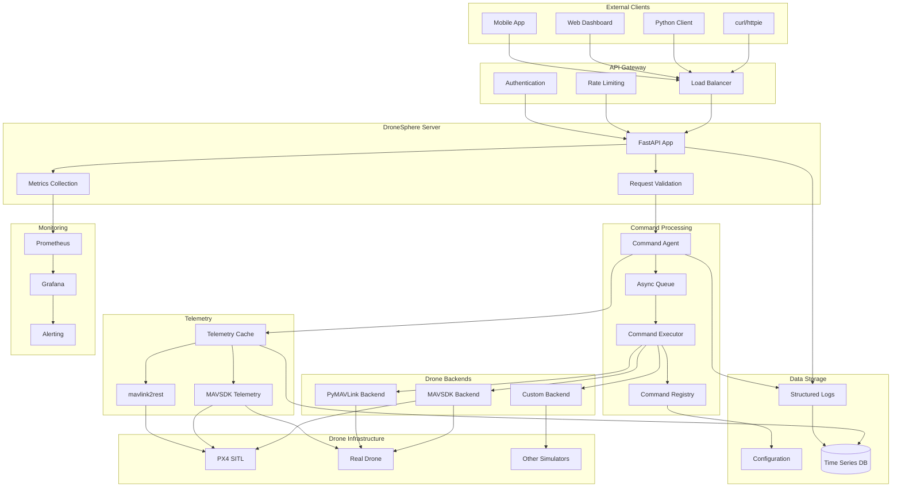
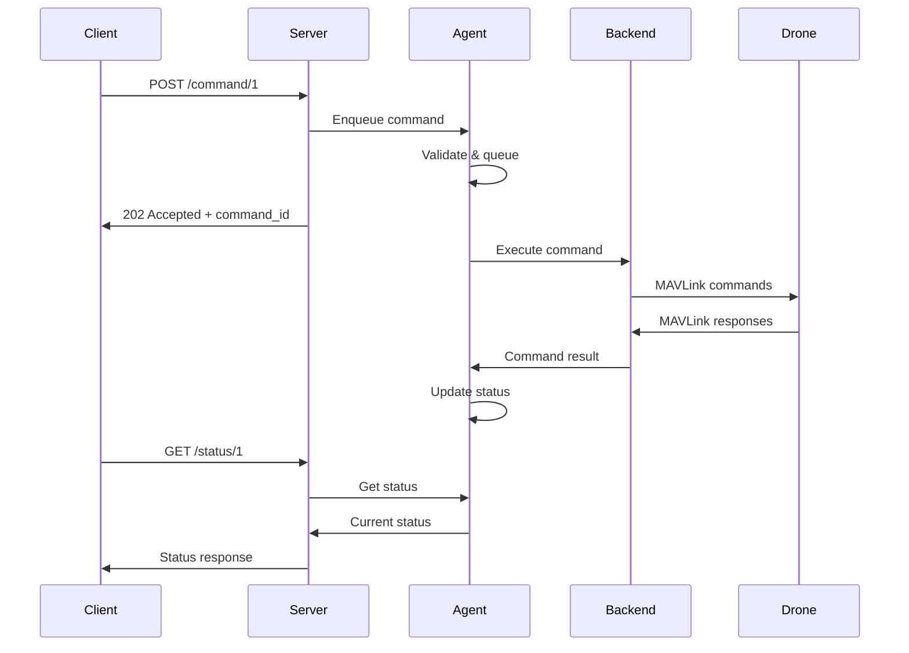
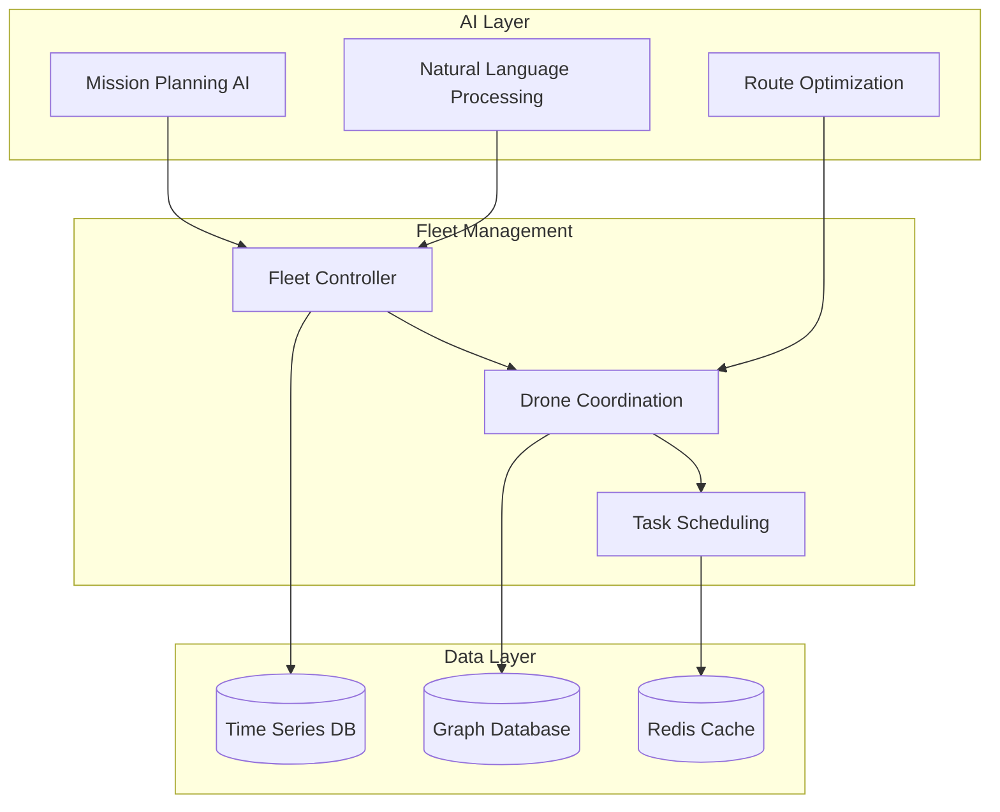

# docs/architecture.md
# ===================================

# Architecture

DroneSphere follows a modular, layered architecture designed for scalability and extensibility.

## System Overview



## Component Details

### 1. API Layer

**FastAPI Server** (`dronesphere.server`)
- RESTful API endpoints
- OpenAPI/Swagger documentation
- Request validation with Pydantic
- CORS handling
- Rate limiting
- Health checks

**Key Endpoints:**
```
POST /command/{drone_id}     # Execute command sequence
GET  /status/{drone_id}      # Get drone status
GET  /telemetry/{drone_id}   # Get real-time telemetry
GET  /queue/{drone_id}       # Get command queue
POST /emergency_stop/{drone_id}  # Emergency stop
```

### 2. Command Processing

**Command Agent** (`dronesphere.agent`)
- Long-running process
- Manages drone connections
- Handles command queuing and execution
- Provides telemetry caching
- Implements override logic (new commands cancel old)

**Command Registry** (`dronesphere.commands.registry`)
- Loads command specifications from YAML
- Validates parameters against schemas
- Manages command implementations
- Supports hot-reloading of commands

**Command Execution Flow:**


### 3. Backend Abstraction

**Abstract Backend** (`dronesphere.backends.base`)
```python
class AbstractBackend:
    async def connect() -> None
    async def arm() -> None
    async def takeoff(altitude: float) -> None
    async def land() -> None
    async def hold_position() -> None
    async def get_state() -> DroneState
```

**MAVSDK Backend** (`dronesphere.backends.mavsdk`)
- Production-ready MAVLink implementation
- Supports PX4 and ArduPilot
- Async/await interface
- Robust error handling

**Future Backends:**
- PyMAVLink for lower-level control
- DJI SDK for commercial drones
- Custom protocols for specialized hardware

### 4. Telemetry System

**Hybrid Approach:**
- Commands via MAVSDK (reliable, well-tested)
- Telemetry via configurable provider
- Real-time caching and streaming

**Telemetry Data Model:**
```python
class Telemetry:
    drone_id: int
    timestamp: datetime
    state: DroneState
    position: Position
    attitude: Attitude
    velocity: Velocity
    battery: Battery
    gps: GPS
    health_all_ok: bool
```

### 5. Configuration Management

**YAML-based Configuration:**
- Command specifications in `shared/commands/`
- Drone configurations in `shared/drones.yaml`
- Environment-specific settings via `.env`
- Pydantic validation for type safety

**Command Specification Example:**
```yaml
apiVersion: v1
kind: DroneCommand
metadata:
  name: takeoff
  version: 1.0.0
spec:
  parameters:
    altitude:
      type: float
      constraints: {min: 1.0, max: 50.0}
  implementation:
    handler: "dronesphere.commands.takeoff.TakeoffCommand"
    timeout: 60
```

## Scalability Design

### Horizontal Scaling

**Current (Phase 1):**
- Single drone, single agent/server process
- Suitable for development and small operations

**Future (Phase 2+):**
- Multiple agents handling drone fleets
- Load-balanced API servers
- Distributed command queuing
- Database-backed state management

### Vertical Scaling

**Resource Optimization:**
- Async/await throughout the stack
- Connection pooling and reuse
- Efficient telemetry caching
- Configurable update intervals

### Extension Points

**AI/LLM Integration (Future):**
```python
# Natural language command processing
class NLPCommandProcessor:
    async def parse_intent(text: str) -> CommandSequence
    async def validate_safety(sequence: CommandSequence) -> bool
    async def optimize_mission(sequence: CommandSequence) -> CommandSequence
```

**Mission Planning (Future):**
```python
class MissionPlanner:
    async def plan_route(waypoints: List[Position]) -> CommandSequence
    async def optimize_for_battery() -> CommandSequence
    async def consider_weather(conditions: WeatherData) -> CommandSequence
```

## Security Considerations

### Current Security Model

**Development-Focused:**
- Trusted network assumption
- No authentication in Phase 1
- Rate limiting for DoS protection
- Input validation and sanitization

### Future Security Features

**Production Security:**
- JWT-based authentication
- Role-based access control (RBAC)
- API key management
- Audit logging
- Encryption in transit/at rest

**Drone Security:**
- Secure MAVLink channels
- Certificate-based drone authentication
- Command signing and verification
- Geofencing enforcement

## Deployment Patterns

### Development Deployment

```bash
# Local development
./scripts/run_sitl.sh          # Start SITL
python -m dronesphere.agent    # Start agent
uvicorn dronesphere.server.api:app  # Start server
```

### Docker Deployment

```bash
# All-in-one development
docker-compose up

# Production deployment
docker-compose -f docker-compose.prod.yml up
```

### Kubernetes Deployment (Future)

```yaml
apiVersion: apps/v1
kind: Deployment
metadata:
  name: dronesphere-server
spec:
  replicas: 3
  template:
    spec:
      containers:
      - name: server
        image: dronesphere/server:latest
        resources:
          requests: {cpu: 100m, memory: 128Mi}
          limits: {cpu: 500m, memory: 512Mi}
```

## Performance Characteristics

### Latency Targets

- **Command acknowledgment:** < 100ms
- **Telemetry updates:** 4Hz (250ms interval)
- **API response time:** < 200ms (95th percentile)
- **Command execution start:** < 1s

### Throughput Targets

- **API requests:** 1000+ RPS
- **Concurrent commands:** 100+ drones
- **Telemetry streaming:** 10,000+ clients
- **Command queue depth:** 1000+ commands

### Resource Usage

**Per Drone (typical):**
- Memory: 50-100MB
- CPU: 10-50m cores
- Network: 1-10 kbps
- Storage: 100MB/day (logs + telemetry)

## Monitoring and Observability

### Metrics Collection

**Application Metrics:**
- Request rates and latencies
- Command success/failure rates
- Queue depths and processing times
- Telemetry update frequencies

**System Metrics:**
- CPU, memory, network usage
- Docker container health
- Database performance
- Connection pool status

### Logging Strategy

**Structured Logging:**
```json
{
  "timestamp": "2025-01-15T10:30:00Z",
  "level": "INFO",
  "logger": "dronesphere.agent",
  "message": "Command executed successfully",
  "drone_id": 1,
  "command_id": "cmd_123",
  "duration": 5.2,
  "correlation_id": "req_abc"
}
```

### Health Checks

**Multi-level Health Monitoring:**
- `/health` - Overall system health
- `/ready` - Readiness for traffic
- Component-specific health checks
- Drone connectivity monitoring

## Future Architecture Evolution

### Phase 2: Multi-Drone + AI



### Phase 3: Enterprise Scale

- **Multi-tenant architecture**
- **Global deployment with edge nodes**
- **Advanced AI capabilities**
- **Integration with external systems**
- **Regulatory compliance features**
