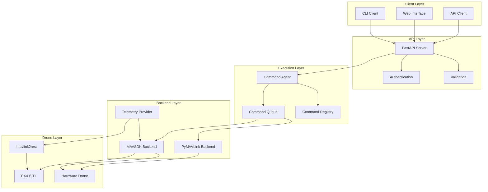

# docs/index.md
# ===================================

# DroneSphere Documentation

Welcome to DroneSphere - a scalable drone command and control system built for the future.

## 🎯 Overview

DroneSphere is a modular, extensible framework for drone fleet management that scales from single-drone operations to AI-powered autonomous systems. The Phase 1 MVP provides:

- **REST API** for drone command and control
- **Real-time telemetry** streaming
- **Command validation** and execution
- **SITL integration** for safe development
- **Extensible architecture** ready for AI/LLM integration

## 🚀 Quick Start

### Prerequisites

- Python 3.10+
- Docker & Docker Compose
- Git

### Installation

```bash
# Clone repository
git clone https://github.com/yourusername/dronesphere.git
cd dronesphere

# Setup environment
uv venv && source .venv/bin/activate
uv pip install -e .[dev]

# Start SITL
./scripts/run_sitl.sh

# Run system
python -m dronesphere.agent &
uvicorn dronesphere.server.api:app --port 8000
```

### First Flight

```bash
# Execute takeoff → wait → land sequence
curl -X POST localhost:8000/command/1 \
  -H "Content-Type: application/json" \
  -d '{
    "sequence": [
      {"name": "takeoff", "params": {"altitude": 5}},
      {"name": "wait", "params": {"seconds": 3}},
      {"name": "land"}
    ]
  }'

# Monitor progress
curl localhost:8000/status/1
curl localhost:8000/telemetry/1
```

## 📚 Documentation Structure

- **[Architecture](architecture.md)** - System design and components
- **[API Reference](api.md)** - REST endpoints and schemas
- **[Command Schema](command-schema.md)** - Command specification format
- **[Development](development/)** - Setup, testing, and contributing
- **[Deployment](deployment.md)** - Production deployment guide

## 🏗️ Architecture Overview



## 🎯 Key Features

### Phase 1 (Current)
- ✅ Single drone support
- ✅ Basic commands (takeoff, land, wait)
- ✅ REST API with real-time status
- ✅ PX4 SITL integration
- ✅ Structured telemetry
- ✅ Docker deployment

### Phase 2 (Planned)
- 🔄 Multi-drone coordination
- 🔄 Natural language commands via LLM
- 🔄 Mission planning AI
- 🔄 Time-series telemetry database
- 🔄 Real-time dashboard

### Phase 3 (Future)
- 🔮 Fleet management
- 🔮 Advanced AI capabilities
- 🔮 Hardware integration
- 🔮 Cloud deployment
- 🔮 Enterprise features

## 🛡️ Safety First

DroneSphere is built with safety as the primary concern:

- **Geofencing** - Configurable flight boundaries
- **Failsafe systems** - Automatic emergency responses
- **Command validation** - Pre-flight safety checks
- **State management** - Consistent drone state tracking
- **Emergency stop** - Immediate halt capabilities

## 🤝 Contributing

We welcome contributions! Please see our [Contributing Guide](development/contributing.md) for details.

## 📄 License

Licensed under the Apache License, Version 2.0. See [LICENSE](../LICENSE) for details.

## 🆘 Support

- 📖 [Documentation](https://yourusername.github.io/dronesphere)
- 🐛 [Issue Tracker](https://github.com/yourusername/dronesphere/issues)
- 💬 [Discussions](https://github.com/yourusername/dronesphere/discussions)

---

**Ready to take flight? Let's build the future of autonomous systems together! 🚁**